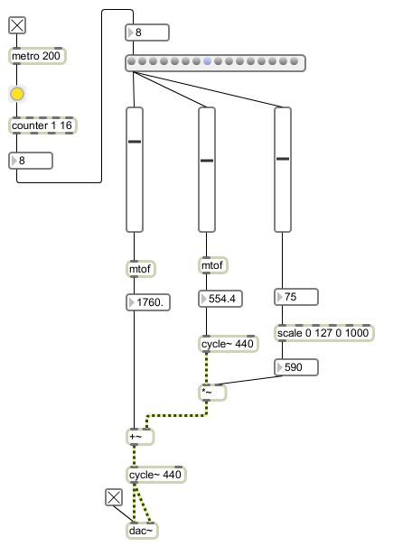

Here's a shot of the [fm synthesis patch](http://www.soundonsound.com/sos/apr00/articles/synthsecrets.htm) we threw together in PerfTech today;

And here's what it sounds like; \[soundcloud url="http://api.soundcloud.com/tracks/5864108" params="show\_comments=true&auto\_play=false&color=ff7700" width="100%" height="81" \] Get a [copy of the max patch](http://dl.dropbox.com/u/301761/fmsurf.maxpat) also if you want.
