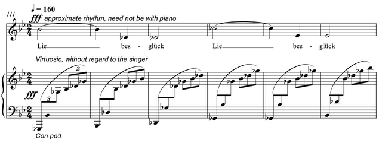

This Tuesday 3rd May at 1600 sees the performance of the only piece I have in this year's [Plug festival](http://issuu.com/debijane/docs/plug_programme) at the RSAMD in Glasgow, _Liebesglück hat tausend Zungen_ – a lied, for soprano and piano. Now, why on earth, you say would anyone in this day and age want to write a _lied_ of all things?! Good question: I'm not sure I know the answer. However, the fact is that the unifying theme of this year's festival is deemed to be something called the Glasgow _Liederbuch_, to which all the composer have been invited to contribute. Which means, two and several bit concerts devoted to new _lieder_. Written within rather strict guidelines, I have to say, voice and piano only, no electronics, German poetic text from the era… basically, we're not allowed to do anything which Schubert didn't do. (So, eg dying of syphillis and not finishing symphonies is ok, playing inside the piano is not.)

There's a [.pdf file](http://tedthetrumpet.files.wordpress.com/2012/07/liebesglucc88ck-hat-tausend-zungen.pdf) of the score if anyone is particularly curious to see in what way I've tackled this rather odd commission. Have I done anything Schubert wouldn't have done? I think so, I think so :)

