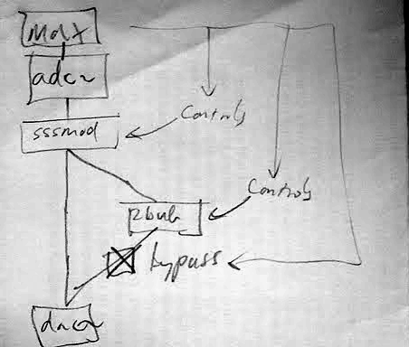

'The diagram is the program' according to [Miller Puckette](http://crca.ucsd.edu/~msp/ "http://crca.ucsd.edu/~msp/"), creator of Pd and (originally) Max. But sometimes you have to draw the diagram too… :)
