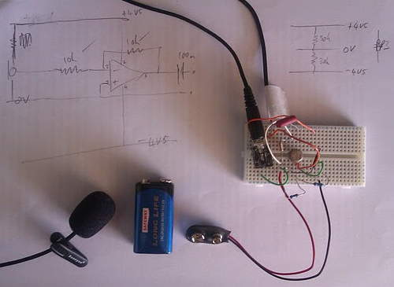

 

Up to something a bit different today: electronics! Yum. I'm building a simple op-amp virtual earth mixer, which I'm going to use to combine the signal from seven cheapo tie-pin mics, one for each pair of keys. A few false starts today, bit rusty on this, but now have a simple circuit running from a 9v battery, which is producing really a very good sound indeed from a £3 mic. Off to buy six more of them, then…
