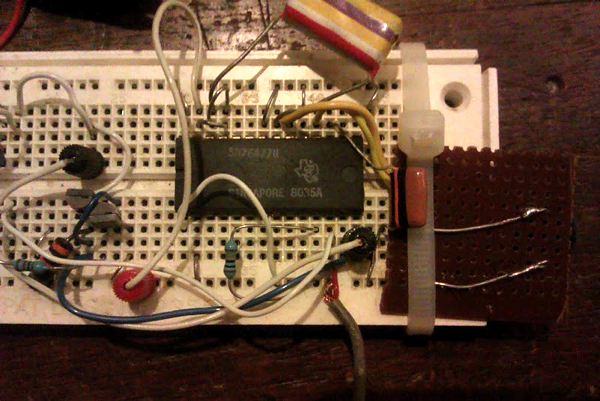

\[soundcloud url="http://api.soundcloud.com/tracks/20785288"\]

'trip points one-shot cap' is (yet another) piece inspired by ripped off from alluding to Louis Andriessen's gritty post-minimalist classic 'Hoketus'.

There are two main building blocks. The first is… I was rummaging around in my box of old electronics, and found an optical theremin I'd built years ago. The IC at the heart of this is a bit of a classic, a Texas Instruments [SN76477](http://en.wikipedia.org/wiki/Texas_Instruments_SN76477 "http://en.wikipedia.org/wiki/Texas_Instruments_SN76477"), a very early chip designed to make sounds for toys and games, also great for musical experimentation.

The second part of the track is itself made up of two layers. At the bottom is a two-second slice (ntfot82.aif) of an improvisation made with… well, to tell the truth, I can't remember! An out-of-tune guitar played with a chopstick, I think, but I'm not sure what I was processing it through, might have been hardware, might have been software. This short file was then sliced up and remixed in [SuperCollider](http://supercollider.sourceforge.net/ "http://supercollider.sourceforge.net/") (code below).

The final track was composed in Logic 9: no added effects there apart from a bit of fake stereo.

> `//SuperCollider code s.boot;`
> 
> p = "/Users/jsimon/Music/tedsound/prosim/nolap\_firstofthese/slices/ntfot82.aif"; b = Buffer.read(s, p); b = Buffer.read(s, p, bufnum: 0); b.play; //quick check
> 
> b.free; // eventually
> 
> ( SynthDef(\\mybuf, { |out, bufnum, sig, rate=1, slices=16, slice=16| var myenv, env, start, len; len = BufFrames.kr(bufnum); start = (len / slices \* slice); myenv = Env.linen(0.01, 0.2, 0.1); //attack, sustain, release sig = PlayBuf.ar(2, bufnum, BufRateScale.kr(bufnum) \* rate, startPos: start, loop: 1); env = EnvGen.kr(myenv, Impulse.kr(0), doneAction: 2); Out.ar(out, sig \* env) }).add; )
> 
> ( a = Pbind( \\instrument, \\mybuf, \\slice, Prand((1 .. 16), inf) ); )
> 
> a.play;
> 
> ( b = Pbind( \\instrument, \\mybuf, \\slice, Pseq((1 .. 16).scramble, inf) ); )
> 
> b.play;
> 
> ( c = Pbind( \\instrument, \\mybuf, \\slice, Pseq((1 .. 16).pyramid, inf) ); )
> 
> c.play;
> 
> // this is medium fab // need to get \\freq or something in the synth also // also figger out how buffer number allocation works // could allocate several buffers and switch between?!?
> 
> TempoClock.default.tempo = 160/60;
> 
> ( d = Pbind( \\instrument, \\mybuf, \\slice, Pseq((1 .. 16).pyramid(9), 1), // careful pyramid returns all kinds of different length arrays // 136, 256, 271 seems to be the three possibilities // (1 .. 16).pyramid(9).size; -> 256 \\dur, 0.5 ); )
> 
> d.play;
