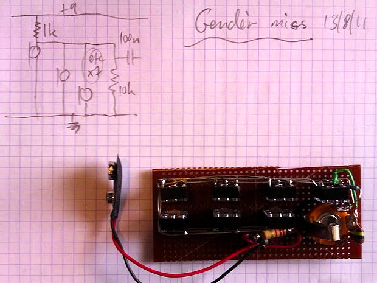

The gendèr miking strategy just got simpler again. After some experimentation, it turned out I was getting better results by just whacking all seven mikes in parallel and 'mixing' them with a single 10k resistor. Loads of cross talk, but for this setup it doesn't really matter. The virtual-earth op-amp design wasn't working out, trying to make it run from a single 9v battery was giving me headaches. This is sounding pretty good, perhaps a bit too much percussive thump at the start of the note: need to find a different way of mounting the mikes, at the moment they are just blu-tacked to the casing.
