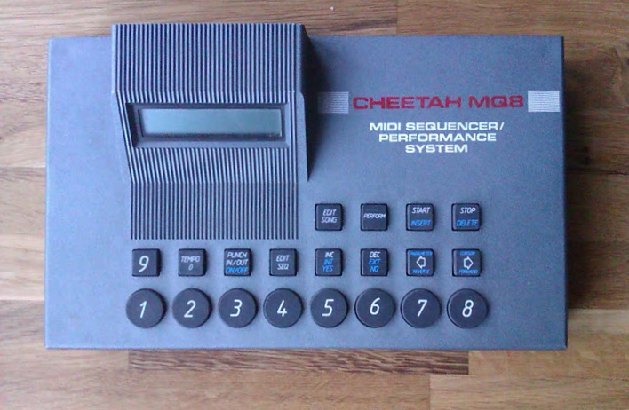

I've just got a new toy (tx John!). It's a [Cheetah MQ8 midi sequencer](http://www.sonicstate.com/synth/cheetah_mq8/ "http://www.sonicstate.com/synth/cheetah_mq8/"). This is UK made, apparently released sometime in the late 80s as a competitor to the Alesis MMT-8. I've only just started to figure it out: pretty crazy trying to do everything with a combination of button presses and a tiny, dim LCD screen!

Here's a two track improvisation, using sounds from my trusty Casio GZ-50M.

\[audio src="https://tedthetrumpet.files.wordpress.com/2008/09/cheetr.mp3"\]\[/audio\]

[cheetr.mp3](http://tedthetrumpet.files.wordpress.com/2008/09/cheetr.mp3)
