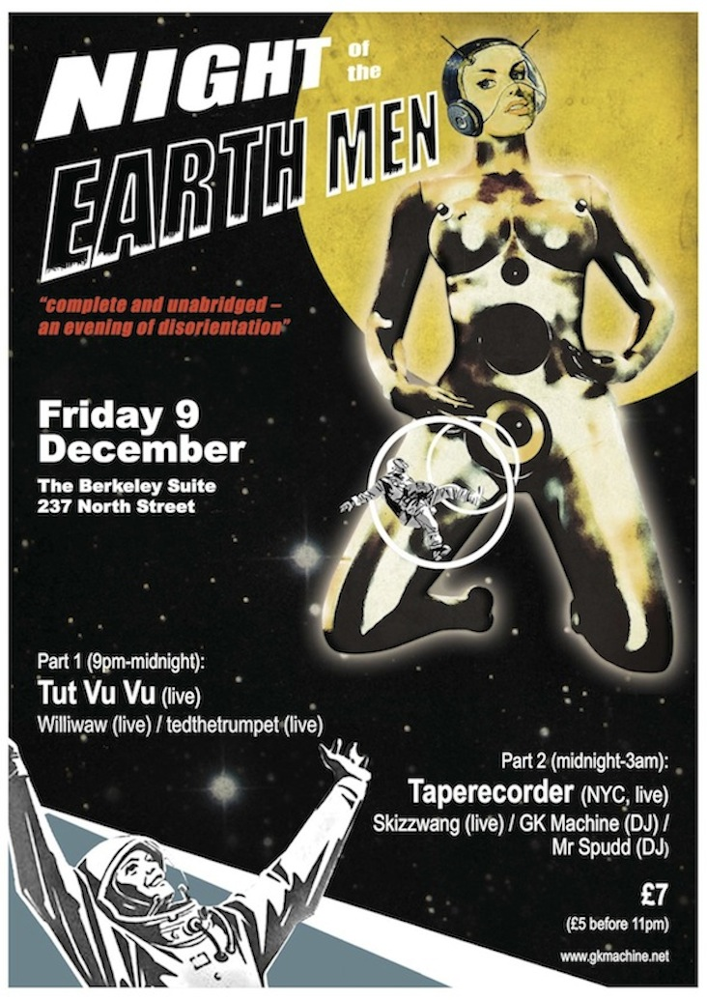

I'm doing, um, I guess my first ever solo electro-junk improv gig on Friday 5 December. Ulp. Here's the poster… I'm almost embarrased to say:

Let's see, the plan includes… a Pd patch running on the netbook, probably SuperCollider running on the (new secondhand) MacBook Pro. The Novation BassStation and the Hammond AutoVari 64, a mixing desk, and a pocket trumpet with a piezo mic inside a harmon mute. That's what I've been experimenting with so far, anyway...
