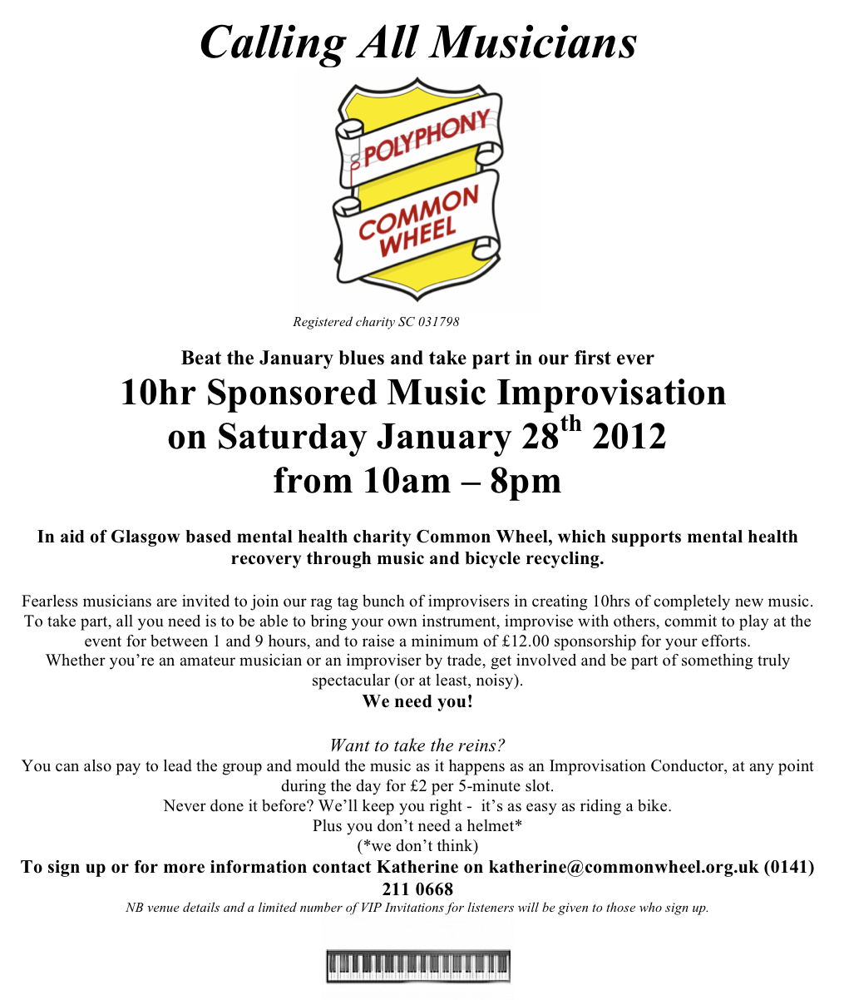

My friend and colleage Kath has persuaded me to sign up for a ten-hour sponsored improvisation which she is organising. The event is in support of [Common Wheel](http://www.commonwheel.org.uk/), a Glasgow-based charity who provided 'meaningful activity for people with mental illness'. They have two strands to their work, a bicyle project and the music project 'Polyphony'. The latter runs at Gartnaval Hospital, where they are asking interested musicians to join them on 28 January for ten hours of sponsored musical improvisation.

I've agreed to sign up for nine hours, which is the longest they are allowing people to attempt. I'm intending to play a variety of instruments, probably all piped through the laptop, maybe sruti box, trumpet, ketipung, and a synth. Should be interesting! As an experiment I had a wee go myself at improvising vocally and over the sruti box the other night, was able to keep going for well over an hour. Still, nine hours… I wonder how that is going to feel!

As well as the musical challenge, of course, it's about the money. If you'd like to sponsor me, you can use the donate link on the Common Wheel website, send me an email as well so that I know, tedthetrumpet (at) gmail.com.

