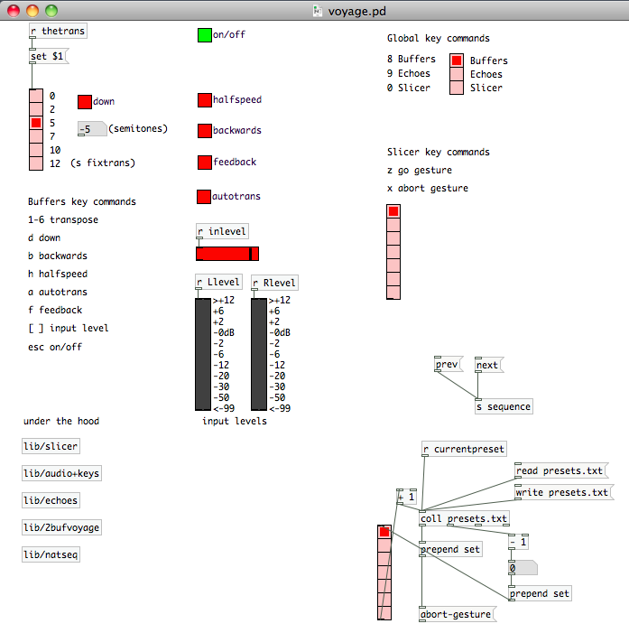

I'm working on about three new pieces at the moment. The second of these is a collaboration with pianist [Silviya Mihaylova](http://silviyamihaylova.com/) on a shortish work for piano and laptop. The piano part is kind of done: Silviya took my sketches and added some ideas of her own. Apart from that, I have a program note, and some programming:

> The title of this piece is taken from Stanisław Lem’s 1971 science fiction comedy classic ‘The Star Diaries’. In ‘The Seventh Voyage’ the hero of the stories, hapless cosmonaut Ijon Tichy, finds his rocket trapped in a loop of time. His attempts to repair the ship’s rudder are continually frustrated by the appearance of younger and older copies of himself:
> 
> “Just a minute,” I replied, remaining on the floor. “Today is Tuesday. Now if you are the Wednesday me, and if by that time on Wednesday the rudder still hasn’t been fixed, then it follows that something will prevent us from fixing it, since otherwise you, on Wednesday, would not now, on Tuesday, be asking me to help you fix it. Wouldn’t it be best, then, for us not to risk going outside?”
> 
> “Nonsense!” he exclaimed. “Look, I’m the Wednesday me and you’re the Tuesday me, and as for the rocket, well, my guess is that its existence is patched, which means that in places it’s Tuesday, in places Wednesday, and here and there perhaps there’s even a bit of Thursday. Time has simply become shuffled up in passing through these vortices, but why should that concern us, when together we are two and therefore have a chance to fix the rudder?!”
> 
> from Stanisław Lem ‘The Star Diaries’ – Chapter 1 ‘The Seventh Voyage’

Lots under the hood, but here's the front page of the pd patch so far:

