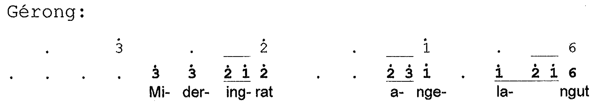

At last, we get to the piece we have all been working towards for so many months:

[Kanda Buwana](http://kandabuwana.wordpress.com/) is the company name of dhalang [Matthew Isaac Cohen](http://pure.rhul.ac.uk/portal/en/persons/matthew-cohen_56dafc87-8be5-49b0-b0c8-b43cca8d85bb.html). I have known Matthew for a number of years, most notably during the period when he was at Glasgow University. Matthew was responsible for bringing dhalang [Ki Joko Susilo](http://www.gamelan.org/jokosusilo/index.html) to Scotland, and Mas Joko, as we called him, was in turn reponsible for a transformation in the approach of [Gamelan Naga Mas](http://nagamas.co.uk/). He brought to us a great chunk of highly distinctive repertoire, most of it derived from the wayang, which we still play today: a talu, unusual srepeg and sampak, and Joko's arrangements of such pieces as Caping Gunung, Gambang Suling and Wong Donya. Our musical director [Signy Jakobsdottir](http://www.facebook.com/signyj1) soaked up a year's worth of wayang drumming from Joko: Matthew was always around, playing peking devising wayang in English with Joko, with his then young daughter Hannah climbing all over him in rehearsal. Happy days.

To commemorate 30th anniversary of York's [Gamelan Sekar Petak](http://www-users.york.ac.uk/~nfis1/gamesp.htm), Matthew created 'Lokananta, or the Playerless Gamelan', interweaving a number of different oral and literary sources with music which John Pawson had garnered from gamelan groups across the UK. Each section of the wayang was accompanied by a different group: in order, [Cardiff Gamelan](http://artsactive.org.uk/cardiffgamelan/), Gamelan Midwest (comprising Cheltenham and [Oxford](http://oxfordgamelan.org/)), Gamelan Scotland (Aberdeen University, Gado-gado and [Naga Mas](http://nagamas.co.uk/)), [Gamelan Sekar Petak](http://www-users.york.ac.uk/~nfis1/gamesp.htm) (York), Gamelan South East ([Cambridge](http://www.cambridgegamelan.org.uk/), [Siswa Sukra](http://www.siswasukra.co.uk/), [Southbank Gamelan Players](http://www.sbgp.org.uk/)), Gamelan South West ([Bath Spa](http://www.bathspampa.com/courses/ba-%28hons%29-music/student-work/bath-spa-gamelan/), [Bristol](http://soundcloud.com/bristolgamelan)), and Gamelan North ([Chopwell](http://www.musicalmetal.com/), [Dwi Gambira Sari](http://www.soundwave.org.uk/gamelan/gamelan-north.html), [Durham](http://www.dur.ac.uk/musicon.concerts/activitiesdetails/).)

A full DVD of the show is in preparation, and I'm not going to attempt to describe the whole thing. The high point of the show for me was John Pawson's arrangement of Subakastawa Nyamat. Arrangement is too small a word for it: this was a unique artistic creation, bringing together all of the tunings, players and gamelans in a melding of Kodok Ngorek and Subakastawa. A great wave of building emotion as the first gamelan descended from the heavens, and all the musicians spread around the room gradually joined in singing 'Mideringrat…':

A moment I will never forget.

Though I say so myself, Gamelan Scotland acquitted themselves extremely well: 'blown away' was the response we seemed to get from everyone, not least for the dramatic entrance of our piper Hazen Metro on Margaret Smith's piece [Iron Pipes](http://archive.org/details/ScottishBaliAndIronPipes). Another emotional moment for me as Mags sang her arrangement of Ca' the Yowes, and a scary moment for me when I had to lead the entire audience in a brief kecak! I also played [Gamelunk](http://jsimonvanderwalt.com/works/gamelunk/), of course, which came off pretty well.

As to the wayang itself: the amplifiation of Matthew's voice was not entirely satisfactory on the musician's side of the screen, and there was much I could not follow. Matthew has a wicked sense of humour, and can be very good at the interplay and in-jokes between the musicians and the puppeteer: again, some of this seemed to get lost. I was impressed with Matthew's puppet technique, including a great trick of catching the limbs of one puppet between another and the screen, used to great effect in some of the fight scenes.
