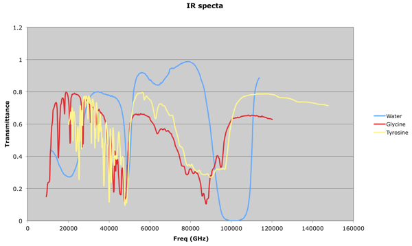
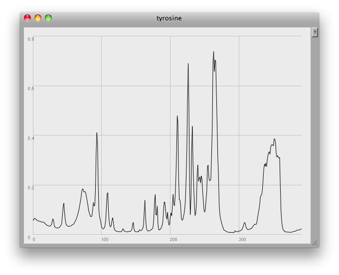

I'm in the very early stages of a collaborative project with [Dr Steven Ford](http://spider.science.strath.ac.uk/sipbs/staff/Steven_Ford.htm), Senior Research Fellow and QC Manager at the Cancer Research UK Formulation Unit of Strathclyde University. Steve came to me with an idea about sonifying IR spectroscopy data, with a view to perhaps drawing some creative parallels between vibrations at the atomic scale and musical sound.

Steve sent me some IR data relating to three compounds, water, glycine and tyrosine, and I've been trying some things out in [SuperCollider](http://supercollider.sourceforge.net/). Here's a plot of the data which Steve sent me: 

Thinking in terms of sound, my immediate thought was to try to scale those resonances into the audio region. Here's one of my first attempts:

`( ~name = "water"; ~path = Document.current.dir.asString++"/"++ ~name ++".csv"; f = CSVFileReader.readInterpret(~path);`

~amps = f.flop\[1\]; // array of amplitudes ~amps.plot(~name, Rect(840,0,600,450));

~freqs = Array.series(f.size, 40, 100); // size, start, step

``{ Klank.ar(`[~freqs, ~amps, nil], PinkNoise.ar(0.01)) }.play; )``

\[audio src="https://tedthetrumpet.files.wordpress.com/2008/09/water01.mp3"\]\[/audio\]

[water01.mp3](http://tedthetrumpet.files.wordpress.com/2008/09/water01.mp3)

There are 784 points of data here, and I've just mapped those arbitrarily to a bank of 784 resonators, spaced 100 Hz apart, starting at 40Hz. It sounds pretty nasty. Then it occured to me that Steve's data is for _transmittance_, not _absorbance_: the points of interest are the troughs, not the peaks, the graph is upside down for what I wanted to do. So:

`( ~name = "tyrosine"; ~path = Document.current.dir.asString++"/"++ ~name ++".csv"; f = CSVFileReader.readInterpret(~path);`

~amps = ((f.flop\[1\] \* -1) + 1).cubed; // invert, massage ~amps.plot(~name, Rect(840,0,600,450));

~freqs = (64..128).resamp1(f.size).midicps;

``{ Klank.ar(`[~freqs, ~amps, nil], PinkNoise.ar(0.01)) }.play; )``

Here I was also starting to think about how to bring out the peaks in the data, hence the .cubed. This does make the data 'pointier', but at the expense of the smaller peaks. A slightly different strategy with the frequencies here also, 784 microtonal pitches between midi notes 64 and 128. It still sounds really pretty nasty:

\[audio src="https://tedthetrumpet.files.wordpress.com/2008/09/tyrosine01.mp3"\]\[/audio\]

[tyrosine01.mp3](http://tedthetrumpet.files.wordpress.com/2008/09/tyrosine01.mp3) 
