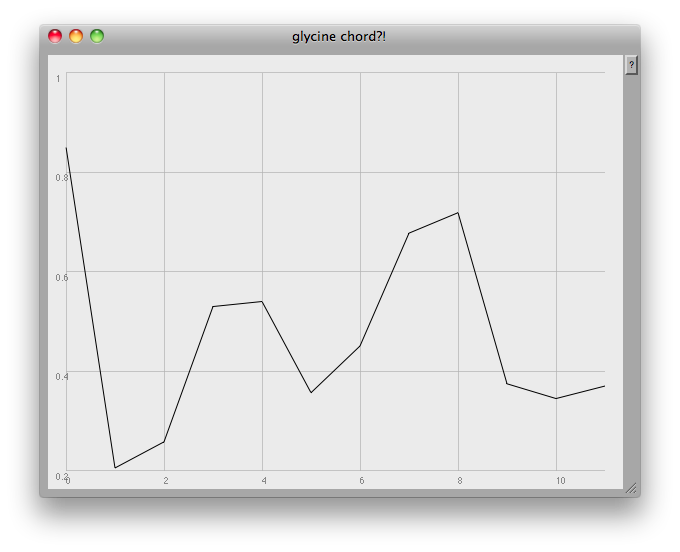
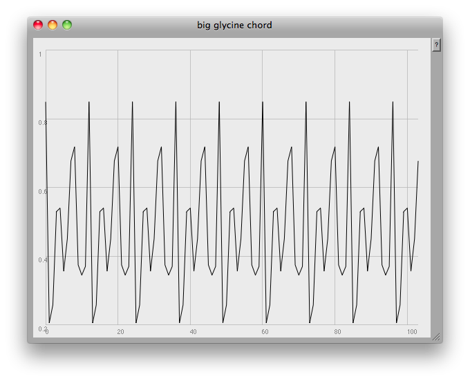
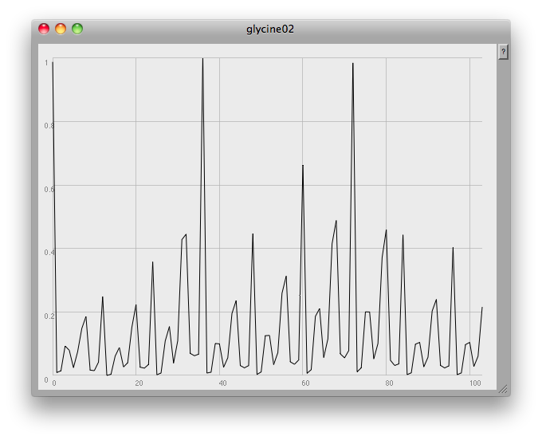

Finding the .resamp1 method in SuperCollider gave me an idea for reducing this rather large set of data into something perhaps more musically useful. Could I make something more like a tonal chord, with pitches repeated in every octave?

I first drastically resampled my data into just twelve points:

`f = ((f.flop[1] * -1) + 1).resamp1(12);` [](http://tedthetrumpet.files.wordpress.com/2012/07/glycinechord.png)

These would then be the probabilities of those twelve pitch classes appearing across a range of eight and a half octaves:

`f = (f++f++f++f++f++f++f++f++f[..7]); // 104 notes`

[](http://tedthetrumpet.files.wordpress.com/2012/07/bigglycinechord.png)

Then what I did was to multiply this chordal structure by the original data, so that my final sound is the 'glycine chord' amplitude modulated (sort of) by the absorbtion data.

[](http://tedthetrumpet.files.wordpress.com/2012/07/glycine02.png)

Here's the final code:

`( ~name = "glycine"; ~path = Document.current.dir.asString++"/"++ ~name ++".csv"; f = CSVFileReader.readInterpret(~path); g = f;`

`f = ((f.flop[1] * -1) + 1).resamp1(12); f = (f++f++f++f++f++f++f++f++f[..7]); // 104 notes  g = ((g.flop[1] * -1) + 1).resamp1(104); // 104 samples of orig graph  ~amps = f.cubed * g; // combining two approaches ~amps = ~amps.normalize; ~amps.plot(~name, Rect(840,0,600,450));  ~freqs = (25..128).midicps;  ```{ Splay.ar(Klank.ar(`[~freqs, ~amps, nil], PinkNoise.ar(0.01))) }.play; )``

I used this approach to make the sound below, which crossfades from glycine to tyrosine to water, then back to glycine again.

\[soundcloud url="http://api.soundcloud.com/tracks/52370172" iframe="true" /\]
