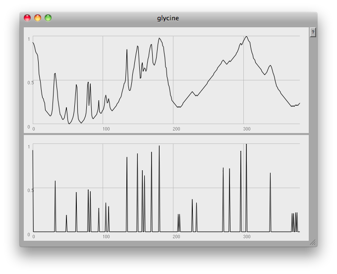

> Emperor Joseph II: **Well, I mean occasionally it seems to have, how shall one say?** \[he stops in difficulty; turning to Orsini-Rosenberg\] **How shall one say, Director**? Orsini-Rosenberg: **Too many notes, Your Majesty?** Emperor Joseph II: \[to Mozart\] **Exactly. Very well put. Too many notes**. From _Amadeus_ (1984)

It occured to me after a while that my previous attempts at dealing with these sets of data were running into a 'too many notes' problem: 784 resonators at once is always likely to sound like noise! What one would like to be able to do would be to focus in on the visible 'peaks':

[](http://tedthetrumpet.files.wordpress.com/2012/07/tyrosine01.png)

This is something a human can do quite intuitively: in fact, I seem to dimly remember that, many years ago, when I worked with HPLC (High Performance Liquid Chromatography) data at Schweppes, there was a pencil and paper method we used to estimate the height and width of a peak, and thus determine the concentration of a compound by calculating the area under the graph.

A little research into the problem of doing this algorithmically rapidly took me far out of my mathematical depth:

> Chao Yang, Zengyou He, Weichuan Yu _Comparison of public peak detection algorithms for MALDI mass spectrometry data analysis_ BMC Bioinformatics. 2009; 10: 4. Published online 2009 January 6. doi: 10.1186/1471-2105-10-4 [http://www.ncbi.nlm.nih.gov/pmc/articles/PMC2631518/](http://www.ncbi.nlm.nih.gov/pmc/articles/PMC2631518/)

Instead, I got some hints on a rather simpler approach from [Daniel Mayer](http://daniel-mayer.at) by asking a [question on the SuperCollider mailing list](http://new-supercollider-mailing-lists-forums-use-these.2681727.n2.nabble.com/Finding-peaks-in-data-td7580579.html).

Here's the code I eventually came up with:

`( ~name = "glycine"; ~path = Document.current.dir.asString++"/"++ ~name ++".csv"; f = CSVFileReader.readInterpret(~path);`

`f = ((f.flop[1] * -1) + 1).normalize;  // these three lines remove plateaus in the data, // otherwise we get missing 'peaks' in the analysis // some int/float voodoo needed here! f = (f*100).asInteger; f = f.differentiate.removeEvery([0]).integrate; f = f/100;  // the magic line which finds the peaks ~peaksIndices = f.differentiate.sign.findAll([1,-1]);  // putting the data back together again g = Array.fill(f.size, 0); ~peaksIndices.do { |i| g[i] = f[i] };  ~amps = g; [f,~amps].plot(~name, Rect(840,0,600,450));  ~freqs = (36..128).resamp1(f.size).midicps;  ```{ Splay.ar(Klank.ar(`[~freqs, ~amps, nil], PinkNoise.ar(0.01))) }.play; )``

At the very end of the plot you can see one of the problems: this method finds any and all local peaks, including ones which to the eye look unimportant:

[](http://tedthetrumpet.files.wordpress.com/2012/07/glycine03.png)

I think what would be needed here would be some low-pass filtering to get rid of small glitches. However, the musical results so far are quite good: once again, here's a short gesture made by crossfading from one compound to another:

\[soundcloud url="http://api.soundcloud.com/tracks/52949967" iframe="true" /\]
