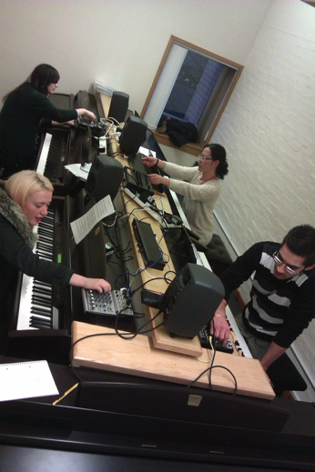

 

From the second rehearsal for RITE: pianists Sinae Lee, Fionnuala Ward, Beth Jerem and Marlon Bordas Gonzalez trying out the fx units, and my script for the piece so far.

RITE for for four performers, four pianos, and four effects units: Friday March 8, 1930, Royal Conservatoire of Scotland. Also featuring works by Steve Reich and Vera Stanojevic, improvisations by Alistair MacDonald, Anto Pett, and Anne-Liis Poll.
