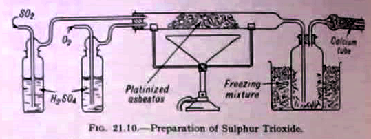

Exactly a month to go now to 'Why Scotland, Why East Kilbride', my Cryptic Nights show at the CCA. Today I met with Steve Ford, who, as well as playing bass is going to be doing the live audio chemistry. Here's an example of the kind of thing we _won't_ be doing: 

Somehow that one never got through the [risk assessment](http://en.wikipedia.org/wiki/Sulphur_trioxide#Safety) :)
