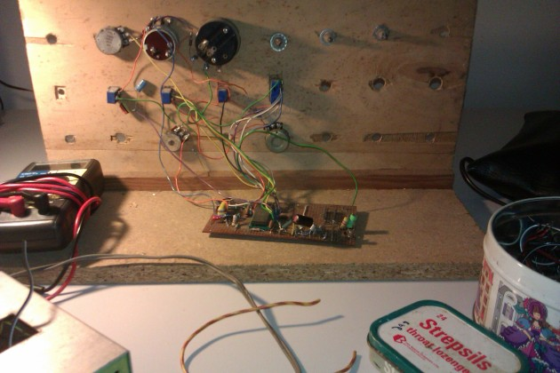
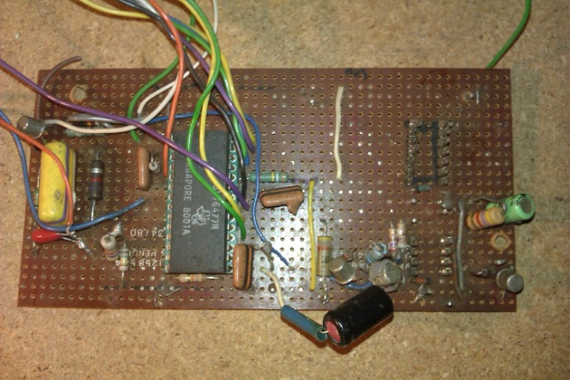

Very happy today. Been working on some electronics for the show. For me as a creator, this is a big part of what [Why Scotland, Why East Kilbride](http://on.fb.me/19l63CT) is about: exploring my nostalgia for teenage evenings spent with a soldering iron, a cup of coffee, and a [Hawkwind album](http://www.discogs.com/Hawkwind-Warrior-On-The-Edge-Of-Time/master/28179).

Some pics below: trying to get my [SN76477](http://en.wikipedia.org/wiki/Texas_Instruments_SN76477) prototyping station back up and running.

