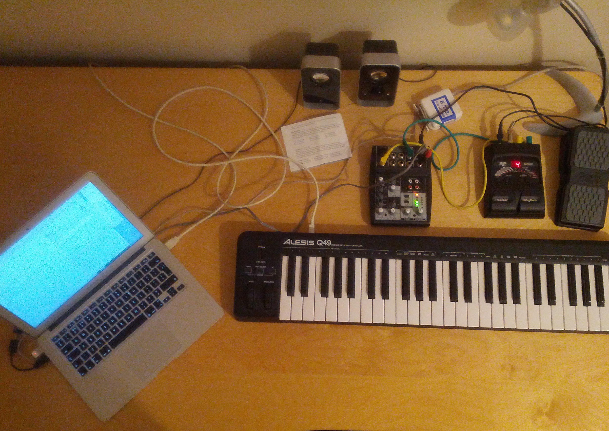

I've been working for a while with an improvising setup that uses what is sometimes jokingly called 'recursive synthesis' – that is, plugging an effect unit back in to itself and experimenting with the no-input feedback sounds.

Today I've had some success with the next step in developing this system. I've written a [SuperCollider](http://supercollider.github.io/) patch that allows me to gate and pitchshift the feedback sounds, so that I can begin to find a way to play them musically using a keyboard. Here's the very first run at playing this system: careful, some rather loud and uncontrolled noises here!

\[audio src="https://tedthetrumpet.files.wordpress.com/2008/09/recursor01demoedit.mp3"\]\[/audio\]

[recursor01demoedit.mp3](https://tedthetrumpet.files.wordpress.com/2008/09/recursor01demoedit.mp3)

In the picture, you can see the work-in-progress setup. There's a cheapo DigiTech RP55 guitar pedal feeding back through a small mixing desk. I'm using a swell pedal to contral some of the parameters of the various fx from the DigiTech, particularly sweeping the pitch of the 'whammy' and 'pitch shift' functions, set up in various presets. The mixing desk is not entirely necessary, but the tone controls are useful to have in the feedback loop.

Below is the code for the SuperCollider patch. As always, my thanks to the developers of this software, and all the help received from the community on the [mailing list](http://new-supercollider-mailing-lists-forums-use-these.2681727.n2.nabble.com/). `( fork{ ~velbus = Bus.control.set(1); // not using yet s.sync; SynthDef(\pitchin, { | midinote = 60, gate = 1, amp = 0.1 | var in, sig, env, ratio, trans, shift, sel; trans = midinote - 60; in = SoundIn.ar([0,1]); ratio = trans.midiratio; shift = PitchShift.ar(in, pitchRatio: ratio, timeDispersion: 0.1); sel = trans.abs > 0; sig = Select.ar(sel, [in, shift]); env = EnvGen.kr(Env.adsr, gate, doneAction: 2); Out.ar(0, sig * env * amp * 37) // compensate for quiet; }).add; }; MIDIClient.init; MIDIIn.connectAll; ~on.free; ~off.free; ~cc1.free; ~notes = Array.newClear(128); // array one slot per MIDI note ~on = MIDIFunc.noteOn({ |veloc, num, chan, src| ~notes[num] = Synth(\pitchin, [\midinote, num, \amp, veloc * 0.2/127]); }); ~off = MIDIFunc.noteOff({ |veloc, num, chan, src| ~notes[num].release; }); ~cc1 = MIDIFunc.cc({ |val| val.postln; ~velbus.set(val/127*4); }, 1, 0 ); // cc1 on channel 0 = midi channel 1, not using yet )`
