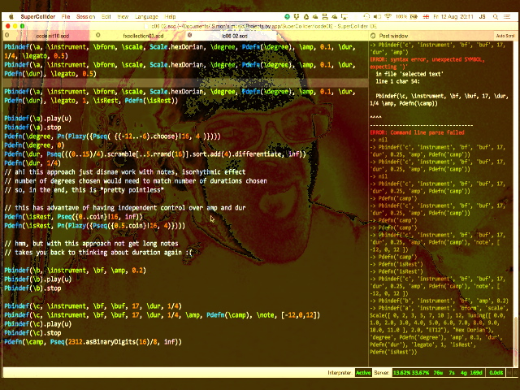

When I was at [emfcamp](https://www.emfcamp.org/) last week, I saw a couple of instances of people layering up visuals with their code. Claudius Maximus had that going with his [clive](https://mathr.co.uk/blog/2012-12-25_clive.html) system, SonicPi (and Gibber??) can do it out of the box, and [Shelly Knotts](https://shellyknotts.wordpress.com/)  had some sort of setup for (I think?) doing it completely within SuperCollider, with the cool idea of a webcam pointing down at her hands on the keyboard.

After a bit of thought, I've come up with this, just a still for now:

How this works: I used a $10 utility called [ScreenCaptureSyphon](http://techlife.sg/ScreenCaptureSyphon/) that can amongst other things grab an application window and send it into Syphon. Then, Resolume Arena runs as a Syphon client, which lets me do almost anything including, as in the shot below, pull in the webcam and colorize. Not tried it yet, but Arena exposes its interface to OSC, so should in theory be possible to script visual changes from the SuperCollider IDE.

A reasonably concinnitous hack, if I say so myself. (MInd you, it's the first thing I've ever done with my MacBook Air that turns the fan on full blast the whole time!)
