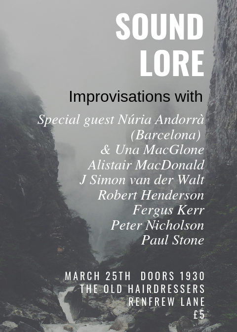

Improviser [Núria Andorrà](http://nuriaandorra.com/) visited Glasgow in March to teach on the International Collaboration in Contemporary Improvisation module at the Royal Conservatoire of Glasgow. My colleage [Una McGlone](https://twitter.com/unabass) took the opportunity to organise a gig for her at [Hairdressers](https://twitter.com/oldhairdressers), in collaboration with a number of Glasgow improvisers.

I did a short set alongside trumpet player Robert Henderson, who I have known for many years: in fact, I know him from the period around twenty years ago where I myself was active as a gigging trumpet player! For this performance, I used a bank of sounds that I have created using purely mechanical sounds from a trumpet, the metal, valves, valve slides and so forth. It's always slightly problematic livecoding alongide an actual analog musician, as it is not easy to respond particularly rapidly to another player. However, Robert and I enjoyed playing together and managed to create some satisfying musical gestures together.

No recording made, unfortunately!

