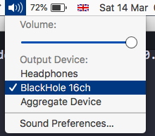
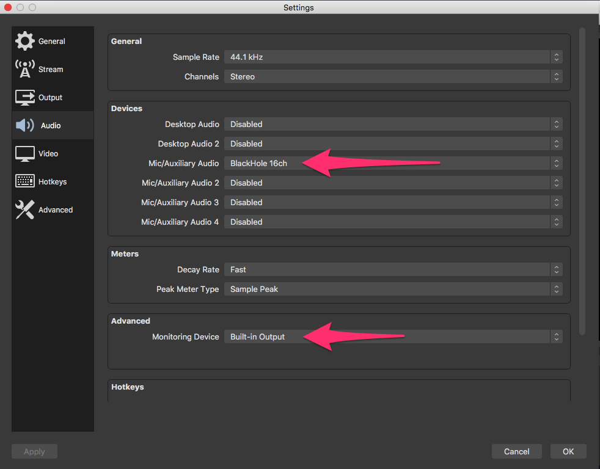
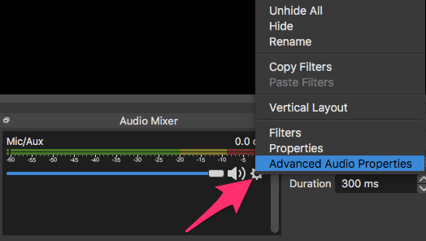
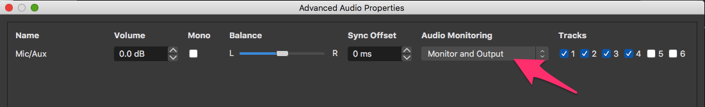
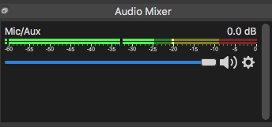

The principle here is that sound is sent from SuperCollider to the virtual audio driver BlackHole, and from BlackHole to OBS. You then listen to the sound through OBS.

Install [https://github.com/ExistentialAudio/BlackHole](https://github.com/ExistentialAudio/BlackHole)

Set the mac sound output to 'BlackHole 16ch' using the widget in the menu bar:

**Boot or reboot the server in SuperCollider** – this is a key step, the SC server will **not** pick up a change of audio device without a fresh boot or a reboot:

After boot, check that the SC post window says '"BlackHole 16ch" Output Device':

(If you're using Tidal you'll need to run SuperDirt.start here again.)

In OBS, click on 'Settings' and go to the 'Audio' pane. Set 'Mic/Auxillary Audio' to 'BlackHole 16ch' and 'Monitoring Device' to 'Built-in Output':

In OBS, look for a gear icon for settings in the Audio Mixer panel select 'Advanced Audio Properties':

Under Audio Monitoring select 'Monitor and Output':

Play a sound in SuperCollider. In OBS, turn up the slider in the Audio Mixer Panel, and you should see the Mic/Aux slider picking up sound:

Sound should now be playing from SC into OBS and through into your speakers/headphones. Adjust volume as usual from the widget in the menu bar.

**Update:** it seems that on macOS 10.15 you may need to go back to the volume widget in the menu bar and select the output you want to hear there. (I can't test this directly, I'm still on 10.13).
